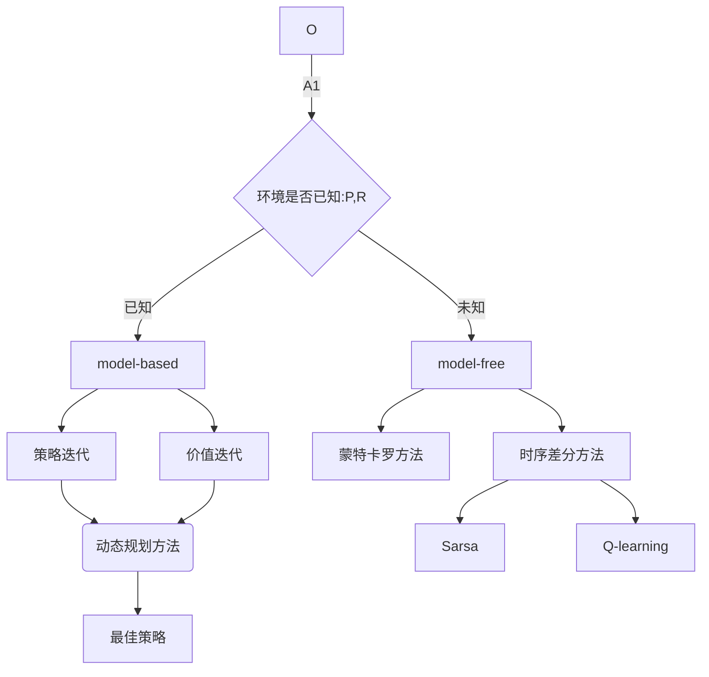

# 第三章 表格型方法
## 目录：
3.1 MDP
    3.1.1 有模型
    3.1.2 无模型
    3.1.3 有无模型区别
3.2 Q表格
3.3 无模型预测 
    3.3.1 蒙特卡罗策略评估
    3.3.2 时序差分
    3.3.3 动态规划方法、蒙特卡洛方法及时序差分方法的自举和采样
3.4 免模型控制
    3.4.1 Sarsa 同策略时序差分控制
    3.4.2 Q学习：异策略时序差分控制
    3.4.3 同策略与异策略区别
    
表格型方法被称作**tabular method**

### 3.1 MDP

* 状态转移概率具有马尔可夫性。即系统下一时刻状态仅由当前时刻决定，不依赖于之前的状态。
* MDP是强化学习的基本学习框架

#### 3.1.1 有模型

* 反应环境模型的量为概率转移函数$P[s_{t+1}, r_t|s_t,a_t]$、奖励函数$R(s_t,a_t)$，其中状态转移概率反映环境的随机性。
* 若概率转移函数、奖励函数已知，则表示环境已知。此时可用策略迭代、价值迭代来找到最佳策略。可用动态规划的方法来计算。

#### 3.1.2 无模型
- 大部分经典方法无模型：状态转移的概率函数与奖励函数未知
- 可应用于完全未知和随机的环境
- 比较哲学的感悟：人通过尝试不同的路来学习，通过尝试不同的路，人类慢慢了解哪个状态会更好。
- 状态好坏的量化方法是价值函数$V(S)$
- 状态动作的价值用Q函数来衡量

#### 3.1.3 有模型与无模型的区别
- 策略迭代与价值迭代需要状态转移概率与奖励函数。在这个过程中是不需要智能体与环境交互的。

### 3.2 Q表格
- Q表格是一张训练好的表格，像一本生活手册。Q值的直观含义是，在某个状态下选择某个动作的后续奖励总和。
-  现实世界中的奖励往往是延迟的，所以强化学习需要学习远期奖励。
-  考虑折扣因子的结构其实多少借鉴了金融数学中的定价方法，未来远期的价值可以用折现因子来体现，因为本身拿到奖励的时长本身是一种“损失”。也能体现，越远期的奖励，对当前的影响力越小。
-  Q表格结构：
    -  行数是所有状态的数量,如cliffwalking例子中的位置坐标等等。
    -  列数是所有动作（上下左右）
    -  刚开始的初始化值为0
    -  智能体不断和环境交互，得到不同轨迹，次数足够多的时候，就可以估算每个状态下，每个动作的总奖励。
    -  Q表格的更新：所谓强化其实就是指我们可以用下一个状态的价值来更新当前状态的价值。在RL里，我们可以用下一个状态的Q值来更新当前状态的Q值。单步更新的方法即为时序差分法。

### 3.3 无模型预测
#### 3.3.1 蒙特卡罗策略评估
采样大量轨迹，对于每一个状态，算所有轨迹的真实回报然后取平均值。
- 使用的方法是empirical mean return
- 不需要MDP里的状态转移函数与奖励函数
- 不需要动态规划里自举的方法
- **局限性在于**：只能用在有终止的马尔可夫决策。
- 大数定律支撑，只要得到足够多轨迹，就可以趋近策略的价值函数。
- 经验均值转换为增量均值
$\mu_t=\frac{1}{t}\sum_{j=1}^{t} x_j=\mu_{t-1}+\frac{1}{t}(x_t-\mu_{t-1})$
通过建立上一时刻的均值与当前均值的关系实现更新。$x_t-\mu_{t-1}$为残差，$\frac{1}{t}$是学习率。在当前episode获得$x_t$后就可以借助上一轮的均值来进行更新。
- 对于蒙特卡洛方法也用增量的形式进行更新
$N(s_t)<-N(s_t)+1$
$V(s_t)<-V(s_t)+\frac{1}{N(s_t)}(G_t-V(s_t))$
- 可用$\alpha$代替$\frac{1}{N(s)}$，表示更新速率。

**动态规划与蒙特卡洛的差异**
动态规划常用<u>**自举**</u>的思想，即基于之前估计的量来估计另一个量。
- 动态规划使用贝尔曼期望备份（Bellman expectaion backup）
$V_i(s)<-\sum_a \pi(a|s)(R(s,a)+\gamma\sum P(s'|s,a)V_{i-1}(s'))$
-将上式迭代至收敛
- 注意有两层加和，内部加和和外部加和。（即两次期望）
- 蒙特卡罗方法适合环境模型未知的情形；动态规划是有模型方法
- 状态数量较多的时候，用动态规划方法进行迭代速度很慢，蒙特卡罗方法较快。
#### 3.3.2 时序差分
- 巴普洛夫的狗，食物是最终的延迟奖励，而铃声是某个会得到肉的状态。可以按照这个顺序建立多级条件反射，用下一个状态的价值强化上一个状态的价值，建立一个状态价值的链条去不断强化。
- 通过训练不断强化高价值状态，直到达到最优策略，agent就会自动往高价值的格子走，最后走到拿奖励的格子。
- [一个关于时序差分中强化概念很好的例子](https://cs.stanford.edu/people/karpathy/reinforcejs/gridworld_td.html)
- 首先这个方法介于蒙特卡罗和动态规划的无模型方法，which means它也不需要状态转移函数和奖励函数
- 可从不完整episode中学习
- 和动态规划一样利用自举思想
- 一步时序差分(one-step TD)TD(0),走一步算一步
- $V(s_t)<-V(s_t)+\alpha(r_{t+1}+\gamma V(S_{t+1})-V(s_t))$
- 估计回报$r_{t+1}+\gamma V(S_{t+1})$时序差分的目标
- 和蒙特卡罗的区别在于，蒙塔卡罗等一条轨迹都跑完了，再更新轨迹上所有状态的值
- 而时序差分，走一步就用自举的方法更新一步。因此可以从不完整序列上学习，而且能在不知道结果的情况下就开始学习。相比蒙特卡罗方法，更加快速和灵活。
- 蒙特卡罗方法没有假设环境具有马尔可夫性，利用刺痒的价值来估计某个状态的价值，非马尔可夫的情形更有效；时序差分则利用了马尔可夫性质，在Markov环境下具有更高的学习效率。
- 时序差分方法还可以进行多步更新，当步数达到整个episode结束就成了蒙特卡罗方法。

#### 3.3.3 动态规划方法、蒙特卡洛方法及时序差分方法的自举和采样。
- 自举：更新时用到了估计
- 采样的方法指通过采样得到期望，
    - 动态规划没有使用采样，直接用贝尔曼方程进行更新。直接计算期望，对所有状态进行加和
$V\left(s_{t}\right) \leftarrow \mathbb{E}_{\pi}\left[r_{t+1}+\gamma V\left(s_{t+1}\right)\right]$
    
    - 蒙特卡罗直接进行采样；采取了一条支路，更新该路径上的所有状态
$V\left(s_{t}\right) \leftarrow V\left(s_{t}\right)+\alpha\left(G_{t}-V\left(s_{t}\right)\right)$
    
    - 时序差分，一部分采样，一部分自举；只关注了一步的更新，非常局部
    $\operatorname{TD}(0): V\left(s_{t}\right) \leftarrow V\left(s_{t}\right)+\alpha\left(r_{t+1}+\gamma V\left(s_{t+1}\right)-V\left(s_{t}\right)\right)$
    
    
    
### 3.4 无模型控制
Generalized policy iteration GPI **广义策略迭代**
兼容蒙特卡洛方法和时序差分方法
**策略迭代的两个步骤**：
1、根据策略估计价值函数
2、贪心方法来改进策略
$Q_{\pi_{i}}(s, a)=R(s, a)+\gamma \sum_{s^{\prime} \in S} P\left(s^{\prime} \mid s, a\right) V_{\pi_{i}}\left(s^{\prime}\right)$

奖励函数与状态转移函数未知的时候通过GPI来进行优化：使用蒙特卡罗来代替动态规划对Q进行估计。得到Q函数后，就通过贪心的方法改进。
- 实践上，$epsilon$会设置成随时间递减。

#### 3.4.1 Sarsa
- on-policy: 优化实际执行的策略
- 用时序差分估计Q函数
- 即将原来估计V的步骤直接改为了估计Q
- $Q\left(s_{t}, a_{t}\right) \leftarrow Q\left(s_{t}, a_{t}\right)+\alpha\left[r_{t+1}+\gamma Q\left(s_{t+1}, a_{t+1}\right)-Q\left(s_{t}, a_{t}  \right) \right]$
- 其实现在是在用Q去逼近$G_T$
- 软更新是指每次只更新一点点
- 用下一步的Q值不断更新当前步的Q值然后不断强化
- 类似n步时间序列，也有n步Sarsa的做法
#### 3.4.2 Q-Learning异策略学习

- off-policy：存在两种不同策略分别是目标策略与行为策略。
    - 目标策略$\pi$:根据经验学习最优，不需要直接与环境进行交互
    - 行为策略$\mu$：用来实际探索环境的策略。可以大胆探索用来采集轨迹和数据。喂给目标策略$(s_t,a_t,r_{t+1},s_{t+1})$学习
    - 优点在于可以利用探索策略来获得最佳策略；可学习其他智能体动作；可节省探索需要的大量资源 
    - $Q\left(s_{t}, a_{t}\right) \leftarrow Q\left(s_{t}, a_{t}\right)+\alpha\left[r_{t+1}+\gamma \max _{a} Q\left(s_{t+1}, a\right)-Q\left(s_{t}, a_{t}\right)\right]$
    - 对于Q学习而言，$a_{t+1}$并不需要行为策略进行选取，而是直接采用Q表格中的最大价值动作。
    - 行为策略更新Q表格，然后目标策略根据Q表格来选动作
    - Q学习根据Q表格来选取动作，不是太担心下一步探索造成的影响，因此表现大胆的多。
    - Q比Sarsa 出现的更早

#### 3.4.3 同策略与异策略的区别
- Sarsa因为收到探索的影响会更加保守
- Q-learning 则选取了最大值最大化的操作。

    

